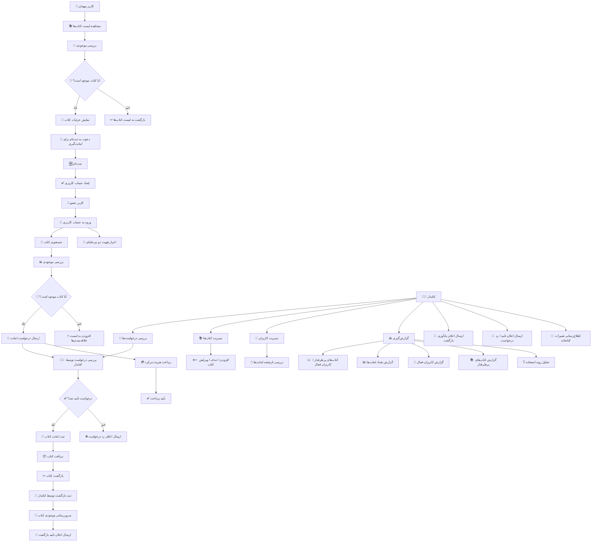

```mermaid
flowchart TD
    %% مسیر مهمان
    A1[👤 کاربر مهمان] --> A2[📚 مشاهده لیست کتاب‌ها]
    A2 --> A3[🔎 بررسی موجودی]
    A3 --> A4{📖 آیا کتاب موجود است؟}
    A4 -- بله --> A5[📄 نمایش جزئیات کتاب]
    A4 -- خیر --> A6[↩️ بازگشت به لیست کتاب‌ها]
    A5 --> A7[📝 دعوت به ثبت‌نام برای امانت‌گیری]
    A7 --> A8[🆕 ثبت‌نام]
    A8 --> A9[✅ ایجاد حساب کاربری]
    A9 --> B1[👤 کاربر عضو]

    %% مسیر عضو
    B1 --> B2[🔐 ورود به حساب کاربری]
    B2 --> B3[🔎 جستجوی کتاب]
    B3 --> B4[📊 بررسی موجودی]
    B4 --> B5{📖 آیا کتاب موجود است؟}
    B5 -- بله --> B6[📩 ارسال درخواست امانت]
    B5 -- خیر --> B7[⭐ افزودن به لیست علاقه‌مندی‌ها]
    B6 --> B8[👨‍💼 بررسی درخواست توسط کتابدار]
    B8 --> B9{✅ درخواست تأیید شد؟}
    B9 -- بله --> B10[📑 ثبت امانت کتاب]
    B10 --> B11[📦 دریافت کتاب]
    B9 -- خیر --> B12[❌ ارسال اعلان رد درخواست]

    %% مسیر کتابدار
    C1[👨‍💼 کتابدار] --> C2[📩 بررسی درخواست‌ها]
    C2 --> B8
    C1 --> C3[📚 مدیریت کتاب‌ها]
    C3 --> C4[➕➖ افزودن / حذف / ویرایش کتاب]
    C1 --> C5[👥 مدیریت کاربران]
    C5 --> C6[📜 بررسی تاریخچه امانت‌ها]
    C1 --> C7[📊 گزارش‌گیری]
    C7 --> C8[📈 کتاب‌های پرطرفدار / کاربران فعال]

    %% مسیر بازگشت کتاب
    B11 --> D1[↩️ بازگشت کتاب]
    D1 --> D2[📝 ثبت بازگشت توسط کتابدار]
    D2 --> D3[🔄 به‌روزرسانی موجودی کتاب]
    D3 --> D4[📢 ارسال اعلان تأیید بازگشت]
%% اعلان‌ها
    C1 --> E1[🔔 ارسال اعلان یادآوری بازگشت]
    C1 --> E2[📢 ارسال اعلان تأیید / رد درخواست]
    C1 --> E3[📢 اطلاع‌رسانی تغییرات کتابخانه]

    %% مسیر امنیت و پرداخت
    B2 --> F1[🔐 احراز هویت دو مرحله‌ای]
    B6 --> F2[💳 پرداخت هزینه دیرکرد]
    F2 --> F3[✅ تأیید پرداخت]

    %% مسیر گزارش و تحلیل
    C7 --> G1[📊 گزارش تعداد امانت‌ها]
    C7 --> G2[👥 گزارش کاربران فعال]
    C7 --> G3[📚 گزارش کتاب‌های پرطرفدار]
    C7 --> G4[💡 تحلیل روند استفاده]
```
