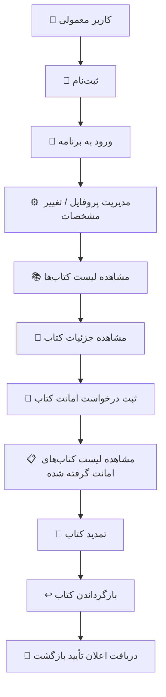

```mermaid
flowchart TD
    A[👤 کاربر معمولی] --> B[📝 ثبت‌نام]
    B --> C[🔐 ورود به برنامه]
    C --> D[⚙️ مدیریت پروفایل / تغییر مشخصات]
    D --> E[📚 مشاهده لیست کتاب‌ها]
    E --> F[📄 مشاهده جزئیات کتاب]
    F --> G[📩 ثبت درخواست امانت کتاب]
    G --> H[📋 مشاهده لیست کتاب‌های امانت گرفته شده]
    H --> I[🔄 تمدید کتاب]
    I --> J[↩️ بازگرداندن کتاب]
    J --> K[📢 دریافت اعلان تأیید بازگشت]
```
